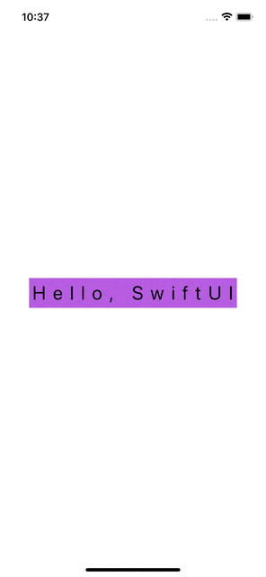

# 100-Days-of-SwiftUI #

Tracking my solutions to the challenge - 100 Days of SwiftUi - by Paul Hudson

https://www.hackingwithswift.com/100/swiftui

## Completion status

Type               | Number  | Completion
:---               |  :---:  |   :---:
Projects           | 19 / 19 | 100%
Challenges         | 57 / 57 | 100%
Milestone Projects |  6 / 6  | 100%

Projects / Topics                                                                                                                                                            | Screenshots
---                                                                                                                                                                          |---
[Project 1](P01-WeSplit) - *WeSplit*     Form, Section, NavigationView, @State, TextField, Picker, ForEach                                                    |  |
[Challenge Day 1](P01-Challenge) - *Converter*                                                                                                                               |  |
[Project 2](P02-GuessTheFlag) - *Guess the Flag*     VStack, Image, Alert                                                                                     |  |
[Project 3](P03-ViewsAndModifiers) - *View and Modifiers*     Views, modifiers, composition, containers                                                       |  |
[Milestone Projects 1-3](P03-Milestone-RockPaperScissors) - *Rock Paper Scissors*                                                                                            |  |
[Project 4](P04-BetterRest) - *BetterRest*     Machine Learning, Dates (DatePicker, DateComponents, DateFormatter) Stepper, navigationBarItems()              |  |
[Project 5](P05-WordScramble) - *Word Scramble*     List, onAppear, Bundle, fatalError(), UITextChecker                                                       |  |
[Project 6](P06-Animations) - *Animations*    Animations and transitions                                                                                      |  |
[Milestone Projects 4-6](P06-Milestone-Multiplication) - *Multiplication Tables*                                                                                             |  |
[Project 7](P07-iExpense) - *iExpense*    UserDefaults, Codable, sheet(), onDelete(), @ObservedObject                                                         |  |
[Project 8](P08-MoonShot) - *Moonshot*     GeometryReader, ScrollView, Navigation, Codable hierarchy, Generics                                                |  |
[Project 9](P09-Drawing) - *Drawing*    Paths, shapes, strokes, transforms, drawing groups, animating values, Core Animation, Metal                           |  |
[Milestone Projects 7-9](P09-Milestone-Habito) - *Habit Tracker*                                                                                                             |  |
[Project 10](P10-CupcakeCorner) - *Cupcakes Corner*      Codable, URLSession, disabled()                                                                      |  |
[Project 11](P11-Bookworm) - *Bookworm*     Core Data, @Binding, Custom components                                                                            |  |
[Project 12](P12-CoreDataProject) - *Core Data*     Core Data                                                                                                 |  |
[Milestone Projects 10-12](P12-Milestone-UsersList) - *Users listing*                                                                                                        |  |
[Project 13](P13-Instafilter) - *Instafilter*     UIKit integration, Core Image, Custom bindings, Action Sheets                                               |  |
[Project 14](P14-BucketList) - *Bucket List*      MapKit, Biometric authentication, Secure data writing, Comparable custom types, Documents directory         |   |
[Project 15](P15-AccessibilityApp) - *Accessibility*     Accessibility                                                                                        |  |
[Milestone Projects 13-15](P15-Milestone-Unforgettable) - *Unforgettable*                                                                                                    |  |
[Project 16](P16-HotProspects) - *Hot Prospects*      Custom environment objects, Tab Views, Result, objectWillChange, Image interpolation, Context menus, Local notifications, Swift package dependencies, filter(), map()  |   |
[Project 17](P17-Flashzilla) - *Flashzilla*    Gestures, haptics, Combine, timers, accessibility                                                              |  |
[Project 18](P18-LayoutAndGeometry) - *Layout and Geometry*     Layout, alignment, geometry, positioning                                                      |  |
[Milestone Projects 16-18](P18-Milestone-DiceRoll) - *Roll the Dice*                                                                                                         |   |
[Project 19](P19-SnowSeeker) - *SnowSeeker*      Split view layouts, optional alerts, flexible layouts with Group, ListFormatter                              | |
